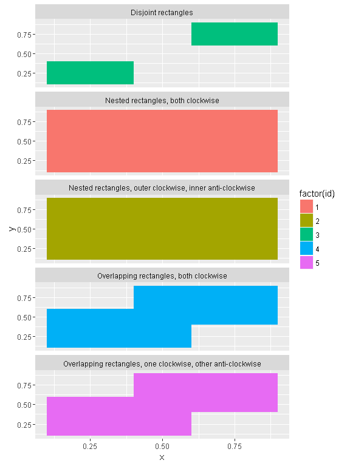
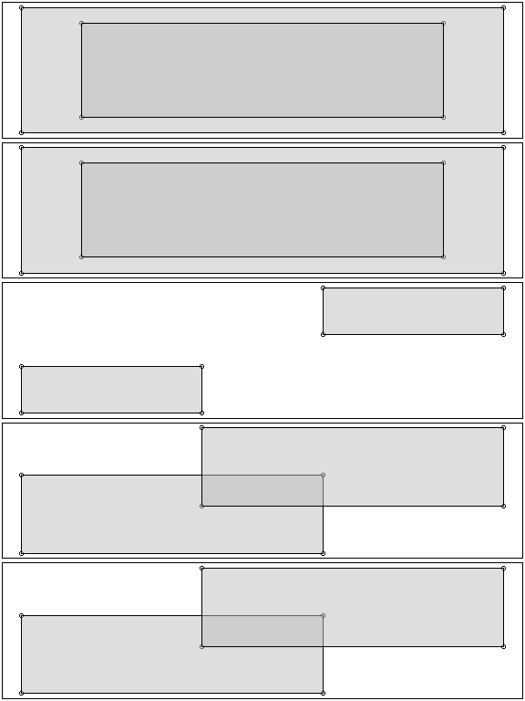
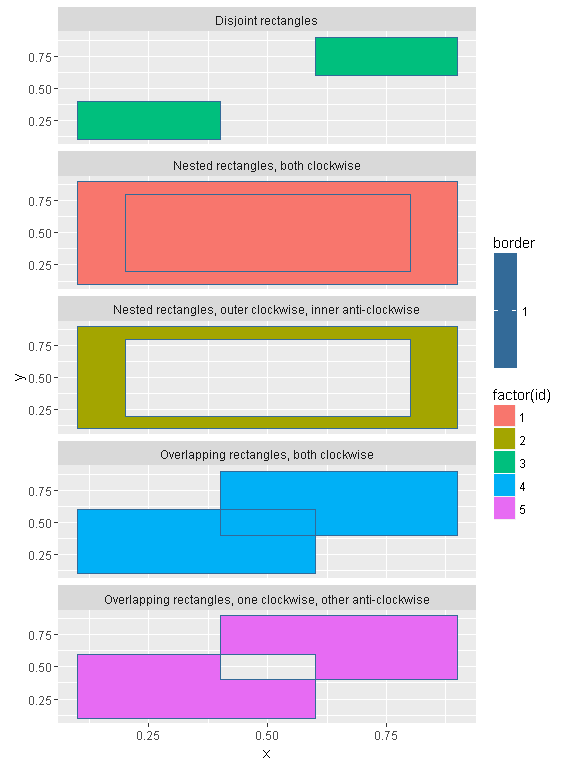
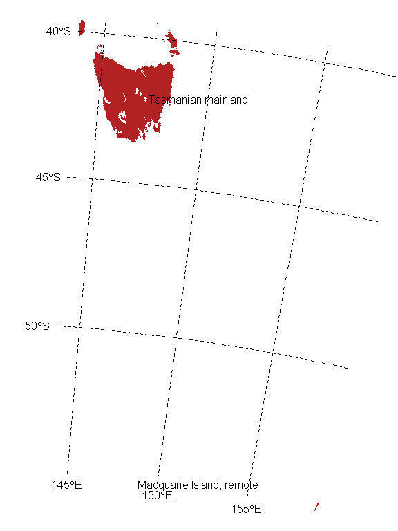

<!-- README.md is generated from README.Rmd. Please edit that file -->

------------------------------------------------------------------------

[](https://travis-ci.org/mdsumner/polyggon) [](https://ci.appveyor.com/project/mdsumner/polyggon) [](https://cran.r-project.org/package=polyggon) [](http://www.r-pkg.org/pkg/polyggon) [](https://codecov.io/github/mdsumner/polyggon?branch=master)

Polygons in R
-------------

It is possible to draw "polygons with holes" with `ggplot2`. Here we show two methods:

1.  Write our own geom for `ggplot2`
2.  Use triangulation

This document was written to complement the discussion here: <http://mdsumner.github.io/2016/03/03/polygons-R.html>

``` r
## taken from ?polypath
##"Nested rectangles, both clockwise")
library(tibble)
library(dplyr)
pts1 <- tibble(x = c(.1, .1, .9, .9, .2, .2, .8, .8),
              y = c(.1, .9, .9, .1, .2, .8, .8, .2), 
              group = c(1, 1, 1, 1, 2, 2, 2, 2), 
              id = 1)

# "Nested rectangles, outer clockwise, inner anti-clockwise")
pts2 <- tibble(x = c(.1, .1, .9, .9,  .2, .8, .8, .2),
               y = c(.1, .9, .9, .1,  .2, .2, .8, .8), 
              group = c(3, 3, 3, 3, 4, 4, 4, 4), 
              id = 2)
#               "Disjoint rectangles")
pts3 <- tibble(x = c(.1, .1, .4, .4, .6, .9, .9, .6),
               y = c(.1, .4, .4, .1,  .6, .6, .9, .9),
               group = c(5, 5, 5, 5, 6, 6, 6, 6), 
               id = 3)
#   "Overlapping rectangles, both clockwise")
pts4 <-   tibble(x = c(.1, .1, .6, .6, .4, .4, .9, .9),
               y = c(.1, .6, .6, .1, .4, .9, .9, .4),
               group = c(7, 7, 7, 7, 8, 8, 8, 8), 
               id = 4)
# "Overlapping rectangles, one clockwise, other anti-clockwise")
pts5 <- tibble(x = c(.1, .1, .6, .6, .4, .9, .9, .4),
               y = c(.1, .6, .6, .1, .4, .4, .9, .9),
               group = c(9, 9, 9, 9, 10, 10, 10, 10), 
               id = 5)
objects <- tibble(id = 1:5, 
                  description = c(
                    "Nested rectangles, both clockwise", 
                    "Nested rectangles, outer clockwise, inner anti-clockwise", 
                    "Disjoint rectangles", 
                    "Overlapping rectangles, both clockwise", 
                    "Overlapping rectangles, one clockwise, other anti-clockwise"
                  ))

          

pts <- bind_rows(pts1, pts2, pts3, pts4, pts5)
library(ggplot2)

## this doesn't look good
ggplot(inner_join(pts, objects)) + 
  aes(x = x, y = y, group = group, fill = factor(id)) + 
  geom_polygon() + facet_wrap(~ description, nrow = 5)
#> Joining, by = "id"
```


The problem is that `geom_polygon` uses `grid::polygonGrob` and this is not capable of drawing holes.

It's as if we decided to use `polygon` in R, it's not going to work. Here I use transparency so we can see the overlapping polygons as slightly darker regions.

``` r
spreadpts <- pts %>% mutate(x = x + id, y = y + id)
split_insert_na <- function(x, f) {
  head(bind_rows(lapply(split(x, f), function(a) rbind(a, NA))), -1)
}

splitpts <- split(spreadpts, spreadpts$id)
op <- par(mfrow = c(5, 1), mar = rep(0.1, 4))
for (i in seq_along(splitpts)) {
  a <- splitpts[[i]]
  plot(a$x, a$y, axes = FALSE, xlab = "", ylab = "")
  polygon(split_insert_na(a, a$group), col = alpha("grey", 0.5))
}
```


``` r
par(op)
#lapply(split(spreadpts, spreadpts$id), function(a) polygon(split_insert_na(a, a$group), col = alpha("grey", 0.5)))
```

But, what if we use `polypath`? Here I'm careful *not* to use transparency, as the behaviour is different on Windows for `windows()` and `png()` - effectively the results is as if we used the `evenodd` rule no matter what `rule` is set to.

``` r
op <- par(mfrow = c(5, 1), mar = rep(0.1, 4))
for (i in seq_along(splitpts)) {
  a <- splitpts[[i]]
  plot(a$x, a$y, axes = FALSE, xlab = "", ylab = "")
  polypath(split_insert_na(a, a$group), col = "grey", rule = "winding")
  
}
```



``` r
par(op)
```

``` r
op <- par(mfrow = c(5, 1), mar = rep(0.1, 4))
for (i in seq_along(splitpts)) {
  a <- splitpts[[i]]
  plot(a$x, a$y, axes = FALSE, xlab = "", ylab = "")
  polypath(split_insert_na(a, a$group), col = "grey", rule = "evenodd")
}
```



``` r
par(op)
```

ggplot2?
--------

There's no way to use `geom_polygon` to get these "polygons with hole" effects. We write a new `geom_holygon`, inspired by a post on the internet - but also include application across different `id` values as well as different group values. This is exactly analogous to the need to call `polypath` multiple times above.

``` r
library(polyggon)
library(ggplot2)
library(grid)
descpoints <- inner_join(pts, objects) %>% mutate(border = 1)
#> Joining, by = "id"
ggplot(descpoints) + 
  aes(x = x, y = y, group = group, fill = factor(id), col = border) + 
  geom_holygon(rule = "winding") + facet_wrap(~ description, nrow = 5)
```


``` r


ggplot(descpoints) + 
  aes(x = x, y = y, group = group, fill = factor(id), col = border) + 
  geom_holygon(rule = "evenodd") + facet_wrap(~ description, nrow = 5)
```


But these are not very complicated polygons!
--------------------------------------------

Ok ok, so let's have a look at some that are.

``` r
library(rgdal)
#> Loading required package: sp
#> rgdal: version: 1.1-10, (SVN revision 622)
#>  Geospatial Data Abstraction Library extensions to R successfully loaded
#>  Loaded GDAL runtime: GDAL 2.0.1, released 2015/09/15
#>  Path to GDAL shared files: C:/inst/R/R/library/rgdal/gdal
#>  Loaded PROJ.4 runtime: Rel. 4.9.2, 08 September 2015, [PJ_VERSION: 492]
#>  Path to PROJ.4 shared files: C:/inst/R/R/library/rgdal/proj
#>  Linking to sp version: 1.2-3

iw <- readOGR(system.file("extdata", "inlandwaters.gpkg", package = "polyggon"), "inlandwaters")
#> OGR data source with driver: GPKG 
#> Source: "C:/inst/R/R/library/polyggon/extdata/inlandwaters.gpkg", layer: "inlandwaters"
#> with 9 features
#> It has 2 fields
plot(iw, col = rainbow(nrow(iw), alpha = 0.4))
```


Indeed those are some pretty riotously complicated polygons.

Check out that detail!

``` r
library(spdplyr)
iw %>% filter(Province == "Tasmania") %>% plot(col = "firebrick", border = NA)
```



``` r
## try again, first we drop the non-main island pieces
tasmain <- iw %>% filter(Province == "Tasmania")
library(spbabel)
sptable(tasmain) <- sptable(tasmain) %>% filter(!island_ | branch_ == 2)
plot(tasmain, col = "firebrick", border = NA)
with(sptable(tasmain), points(x_, y_, pch = "."))
```


``` r


iwsa <- iw %>% filter(Province == "South Australia") 
plot(iwsa, col = "dodgerblue", border = NA, bg = "grey"); p <- par(xpd = NA); llgridlines(iwsa); par(p)
```


Ggplot.

``` r
iwt <- fortify(iw)
#> Regions defined for each Polygons

## admittedly long and lat are not the right names at all
ggplot(iwt) + aes(x = long, y = lat, group = group, fill = id) + geom_holygon()
```


An alternative with triangulation
---------------------------------

To convert a layer of polygons to triangles we first need to decompose the polygons completely into line segments, and to do that we first need the vertices classified by branch and object (each branch, or part, is a "single ring" or "self-connect path").

``` r
library(spbabel)
sph <- sp(holey)
plot(sph[1,], col = "grey")
```



``` r
ggplot(holey %>% filter(object_==1)) + aes(x = x_, y = y_, group = branch_, fill = object_) + geom_holygon()
```


``` r
maptables <- function(dat1, map1) {
  ## we expect that these attributes, taken together are "unique vertices" potentially shared by neighbours
  v_atts <- c("x_", "y_")
  o_atts <- setdiff(names(map1), v_atts)
  b_atts <- setdiff(o_atts, c("order_", "vertex_"))
  bxv_atts <- c(setdiff(names(map1), c("object_", "island_", v_atts)), "vertex_")
 
  ## classify unique vertices by unique index
  ## could tidy this up some more . . .
  map1 <- map1 %>%
    mutate(vertex_  = as.integer(factor(do.call(paste, select_(map1, .dots = v_atts))))) %>% 
    mutate(vertex_ = spbabel:::id_n(length(unique(vertex_)))[vertex_])
  
  branchV_to_segmentV <- function(x) {
    head(matrix(x, ncol = 2, nrow = length(x) + 1L), -1L)
  }
  
  #map1$vertex_ <- id_nrow(nrow(map1))[map1$vertex_]
  ## branches, owner object and island status
  b <- map1 %>% distinct_(.dots = b_atts) 
  ## four tables (dat1, map2, map4, map5)
  bXv <- map1 %>% dplyr::select_(.dots = bxv_atts)
  v <- map1 %>% distinct_(.dots = c(v_atts, "vertex_"))
  res <- list(o = dat1, b = b,  bXv = bXv, v = v)
  res
}
```

Create a list of vertices, branches, and object tables. Vertices and branches are linked by an intermediate table, so that we can store only the unique coordinates.

``` r
mt <- maptables(data.frame(name = "wall", object_ = 1), holey %>% filter(object_ == 1))
nrow(holey %>% filter(object_ == 1))  ## how many coordinates?
#> [1] 32
nrow(mt$v)   ## how many unique coordinates?
#> [1] 26
```

Now we can build a "planar straight line graph" and triangulate. The triangulation algorithm needs the line segments as fully fledged entities, so that it it can ensure those edges exist in the triangle mesh (this is not something the Delaunay criterion provides, so the algorithm is "mostly Delaunay" - see Shewchuk).

``` r
path2seg <- function(x) {
  head(suppressWarnings(matrix(x, nrow = length(x) + 1, ncol = 2, byrow = FALSE)), -2L)
}

mt$v$countingIndex <- seq(nrow(mt$v))
nonuq <- inner_join(mt$bXv, mt$v)
#> Joining, by = "vertex_"
library(RTriangle)
ps <- pslg(P = as.matrix(mt$v[, c("x_", "y_")]), S = do.call(rbind, lapply(split(nonuq, nonuq$branch_), function(x) path2seg(x$countingIndex))))

## TODO: robust hole filtering
## I happen to know this will work, but we can use triangle filtering post hoc too, or use a known inner centroid
ps$H <- holey %>% filter(!island_) %>% 
  group_by(branch_) %>% summarize(xm = mean(x_), ym = mean(y_)) %>% 
  select(xm, ym) %>% 
  as.matrix()
tr <- triangulate(ps)
```

Now we can use polygon or geom\_polygon.

``` r
plot(tr$P)
apply(tr$T, 1, function(tindex) polygon(tr$P[tindex, ], col = "grey", border = NA))
```


    #> NULL

    pol <- tibble(x = tr$P[t(tr$T), 1L], y = tr$P[t(tr$T), 2L], part = rep(seq(nrow(tr$T)), each = 3))
    ggplot(pol) + aes(x = x, y = y, group = part) + geom_polygon()


Clearly to make this useful we need to abstract away another level, so we can have multiple IDs each with multiple parts. I don't think we can use RTriangle as-is to maintain this object level, but that's the same for the graphics functions anyway.
