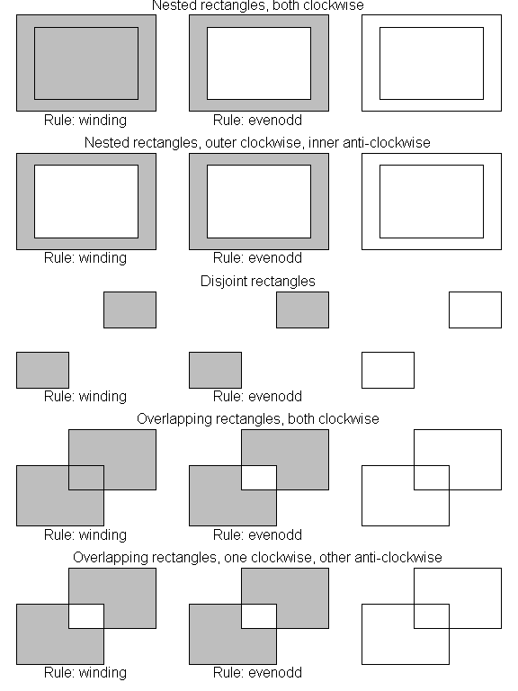
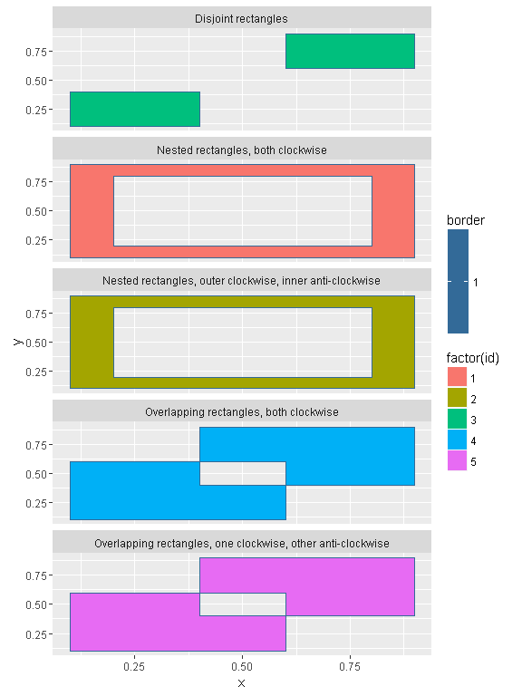

<!-- README.md is generated from README.Rmd. Please edit that file -->

------------------------------------------------------------------------

[](https://travis-ci.org/mdsumner/polyggon) [](https://ci.appveyor.com/project/mdsumner/polyggon) [](https://cran.r-project.org/package=polyggon) [](http://www.r-pkg.org/pkg/polyggon) [](https://codecov.io/github/mdsumner/polyggon?branch=master)

Polygons in R
-------------

Building on this discussion: <http://mdsumner.github.io/2016/03/03/polygons-R.html>

``` r
## taken from ?polypath
##"Nested rectangles, both clockwise")
library(tibble)
library(dplyr)
pts1 <- tibble(x = c(.1, .1, .9, .9, .2, .2, .8, .8),
              y = c(.1, .9, .9, .1, .2, .8, .8, .2), 
              group = c(1, 1, 1, 1, 2, 2, 2, 2), 
              id = 1)

# "Nested rectangles, outer clockwise, inner anti-clockwise")
pts2 <- tibble(x = c(.1, .1, .9, .9,  .2, .8, .8, .2),
               y = c(.1, .9, .9, .1,  .2, .2, .8, .8), 
              group = c(3, 3, 3, 3, 4, 4, 4, 4), 
              id = 2)
#               "Disjoint rectangles")
pts3 <- tibble(x = c(.1, .1, .4, .4, .6, .9, .9, .6),
               y = c(.1, .4, .4, .1,  .6, .6, .9, .9),
               group = c(5, 5, 5, 5, 6, 6, 6, 6), 
               id = 3)
#   "Overlapping rectangles, both clockwise")
pts4 <-   tibble(x = c(.1, .1, .6, .6, .4, .4, .9, .9),
               y = c(.1, .6, .6, .1, .4, .9, .9, .4),
               group = c(7, 7, 7, 7, 8, 8, 8, 8), 
               id = 4)
# "Overlapping rectangles, one clockwise, other anti-clockwise")
pts5 <- tibble(x = c(.1, .1, .6, .6, .4, .9, .9, .4),
               y = c(.1, .6, .6, .1, .4, .4, .9, .9),
               group = c(9, 9, 9, 9, 10, 10, 10, 10), 
               id = 5)
objects <- tibble(id = 1:5, 
                  description = c(
                    "Nested rectangles, both clockwise", 
                    "Nested rectangles, outer clockwise, inner anti-clockwise", 
                    "Disjoint rectangles", 
                    "Overlapping rectangles, both clockwise", 
                    "Overlapping rectangles, one clockwise, other anti-clockwise"
                  ))

          

pts <- bind_rows(pts1, pts2, pts3, pts4, pts5)
library(ggplot2)

## this doesn't look good
ggplot(inner_join(pts, objects)) + 
  aes(x = x, y = y, group = group, fill = factor(id)) + 
  geom_polygon() + facet_wrap(~ description, nrow = 5)
#> Joining, by = "id"
```



The problem is that `geom_polygon` uses `grid::polygonGrob` and this is not capable of drawing holes.

It's as if we decided to use `polygon` in R, it's not going to work. Here I use transparency so we can see the overlapping polygons as slightly darker regions.

``` r
spreadpts <- pts %>% mutate(x = x + id, y = y + id)
split_insert_na <- function(x, f) {
  head(bind_rows(lapply(split(x, f), function(a) rbind(a, NA))), -1)
}

splitpts <- split(spreadpts, spreadpts$id)
op <- par(mfrow = c(5, 1), mar = rep(0.1, 4))
for (i in seq_along(splitpts)) {
  a <- splitpts[[i]]
  plot(a$x, a$y, axes = FALSE, xlab = "", ylab = "")
  polygon(split_insert_na(a, a$group), col = alpha("grey", 0.5))
}
```


``` r
par(op)
#lapply(split(spreadpts, spreadpts$id), function(a) polygon(split_insert_na(a, a$group), col = alpha("grey", 0.5)))
```

But, what if we use `polypath`? Here I'm careful *not* to use transparency, as the behaviour is different on Windows for `windows()` and `png()` - effectively the results is as if we used the `evenodd` rule no matter what `rule` is set to.

``` r
op <- par(mfrow = c(5, 1), mar = rep(0.1, 4))
for (i in seq_along(splitpts)) {
  a <- splitpts[[i]]
  plot(a$x, a$y, axes = FALSE, xlab = "", ylab = "")
  polypath(split_insert_na(a, a$group), col = "grey", rule = "winding")
  
}
```


``` r
par(op)
```

``` r
op <- par(mfrow = c(5, 1), mar = rep(0.1, 4))
for (i in seq_along(splitpts)) {
  a <- splitpts[[i]]
  plot(a$x, a$y, axes = FALSE, xlab = "", ylab = "")
  polypath(split_insert_na(a, a$group), col = "grey", rule = "evenodd")
}
```


``` r
par(op)
```

ggplot2?
--------

There's no way to use `geom_polygon` to get these "polygons with hole" effects. We write a new `geom_holygon`, inspired by a post on the internet - but also include application across different `id` values as well as different group values. This is exactly analogous to the need to call `polypath` multiple times above.

``` r
library(polyggon)
library(ggplot2)
library(grid)
descpoints <- inner_join(pts, objects) %>% mutate(border = 1)
#> Joining, by = "id"
ggplot(descpoints) + 
  aes(x = x, y = y, group = group, fill = factor(id), col = border) + 
  geom_holygon(rule = "winding") + facet_wrap(~ description, nrow = 5)
```


``` r


ggplot(descpoints) + 
  aes(x = x, y = y, group = group, fill = factor(id), col = border) + 
  geom_holygon(rule = "evenodd") + facet_wrap(~ description, nrow = 5)
```


But these are not very complicated polygons!
--------------------------------------------

Ok ok, so let's have a look at some that are.

``` r
library(rgdal)
#> Loading required package: sp
#> rgdal: version: 1.1-10, (SVN revision 622)
#>  Geospatial Data Abstraction Library extensions to R successfully loaded
#>  Loaded GDAL runtime: GDAL 2.0.1, released 2015/09/15
#>  Path to GDAL shared files: C:/inst/R/R/library/rgdal/gdal
#>  Loaded PROJ.4 runtime: Rel. 4.9.2, 08 September 2015, [PJ_VERSION: 492]
#>  Path to PROJ.4 shared files: C:/inst/R/R/library/rgdal/proj
#>  Linking to sp version: 1.2-3

iw <- readOGR(system.file("extdata", "inlandwaters.gpkg", package = "polyggon"), "inlandwaters")
#> OGR data source with driver: GPKG 
#> Source: "C:/inst/R/R/library/polyggon/extdata/inlandwaters.gpkg", layer: "inlandwaters"
#> with 9 features
#> It has 2 fields
plot(iw, col = rainbow(nrow(iw), alpha = 0.4))
```


Indeed those are some pretty riotously complicated polygons.

Check out that detail!

``` r
library(spdplyr)
iw %>% filter(Province == "Tasmania") %>% plot(col = "firebrick", border = NA)
```


``` r
## try again, first we drop the non-main island pieces
tasmain <- iw %>% filter(Province == "Tasmania")
library(spbabel)
sptable(tasmain) <- sptable(tasmain) %>% filter(!island_ | branch_ == 2)
plot(tasmain, col = "firebrick", border = NA)
with(sptable(tasmain), points(x_, y_, pch = "."))
```



``` r


iwsa <- iw %>% filter(Province == "South Australia") 
plot(iwsa, col = "dodgerblue", border = NA, bg = "grey"); p <- par(xpd = NA); llgridlines(iwsa); par(p)
```


Ggplot.

``` r
iwt <- fortify(iw)
#> Regions defined for each Polygons

## admittedly long and lat are not the right names at all
ggplot(iwt) + aes(x = long, y = lat, group = group, fill = id) + geom_holygon()
```


